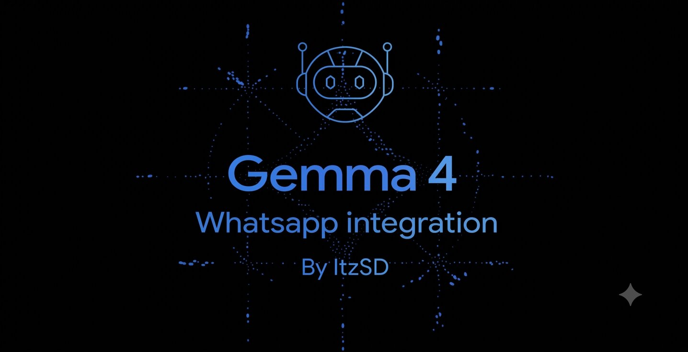

<div align="center">
  
  
  # Gamma BOT for WhatsApp
  
  *An intelligent, highly-secure, multimodal WhatsApp AI Assistant powered by NVIDIA NIM, OpenRouter & Baileys.*
</div>

---

## 🌟 Overview

**Gamma BOT** is a state-of-the-art WhatsApp AI assistant that leverages the power of LLMs via the NVIDIA API or OpenRouter. Designed for headless deployment (such as Pterodactyl panels), it features headless pairing code connections, native WhatsApp text formatting, image vision capabilities, multi-model latency racing, and an enterprise-grade whitelist verification system.

## ✨ Features

- **🏎️ Multi-Model Racing Engine**: Configure multiple models in the settings array. The bot will query them all simultaneously and instantly reply with the one that responds fastest, guaranteeing zero latency spikes!
- **🧠 Multimodal AI Vision**: Not only can Gamma BOT read text, but it can also analyze and describe images you send it!
- **🔒 Secure OTP Verification**: The bot is locked down by default. Users (even the owner) must authenticate via a 2-minute, 3-attempt OTP system to gain whitelist access.
- **📱 Native WhatsApp Formatting**: The AI understands and natively formats its responses using WhatsApp's markdown (Bold, Italics, Lists, etc.).
- **🧹 Auto-Delete Chats**: Configurable option to automatically clear chat history from the bot's device when a session times out or is manually ended.
- **⏱️ Smart Session Management**: Bot goes to sleep after 5 minutes of inactivity to save resources and API credits.
- **📝 24-Hour Rolling Error Logs**: Automatically intercepts and logs server errors to a clean, timestamped text file (`logs/error_YYYY-MM-DD.log`) that rolls over daily.
- **💬 Auto-Chunking**: Extremely long AI responses are automatically chunked and formatted to bypass WhatsApp's character limits without breaking mid-sentence.
- **🚀 Headless Deployment**: Connect securely without scanning a QR code by using the 8-digit WhatsApp pairing code system.

---

## 📋 Prerequisites

- **Node.js**: v20 or higher recommended.
- **NVIDIA or OpenRouter API Key**: You need an API key from [NVIDIA build](https://build.nvidia.com) or [OpenRouter](https://openrouter.ai/) to access the LLM models.
- **WhatsApp Account**: A dedicated WhatsApp number for the bot.

---

## 🚀 Installation & Setup

1. **Clone the repository:**
   ```bash
   git clone https://github.com/yourusername/gamma-bot-whatsapp.git
   cd gamma-bot-whatsapp
   ```

2. **Install dependencies:**
   ```bash
   npm install
   ```

3. **Configure Environment Variables:**
   Rename `.env.example` to `.env` and add your API keys:
   ```bash
   NVIDIA_API_KEY=your_nvidia_api_key_here
   OPENROUTER_API_KEY=your_openrouter_api_key_here
   ```

4. **Customize Settings & Prompts:**
   - Open `default_settings.json` and configure your owner details, timeout settings, and system messages.
   - Set `"llm_provider"` to either `"NVIDIA"` or `"OPENROUTER"`. You can configure the `model`, `max_tokens`, and `temperature` for each provider individually within this file.
   - Open `system_prompt.txt` to customize the AI's personality. It is highly recommended to keep the WhatsApp formatting rules at the bottom of the prompt:
     ```text
     <YOUR SYSTEM PROMPT HERE>
     
     Please use WhatsApp's text formatting to make your responses look great:
     - Bold: *text*
     - Italic: _text_
     - Strikethrough: ~text~
     - Monospace: `text`
     - Bulleted list: Start each line with - or *
     - Numbered list: Start each line with 1., 2., etc.
     - Quote: Start the line with >
     - Inline code: Use `code`
     ```

5. **Start the Bot:**
   ```bash
   npm start
   ```

6. **Link WhatsApp:**
   - On the first boot, the console will ask if you want to link via QR code or Phone Number.
   - Select `Phone Number [2]` if running on a remote/headless server.
   - Enter the bot's phone number with the country code (e.g., `94000000000`).
   - Enter the pairing code provided in the terminal into your WhatsApp app (`Linked Devices -> Link with phone number`).

---

## 🎮 Usage & Commands

By default, the bot ignores all random messages from unverified users. Unverified users can only use the following commands:

- `!alive` - Checks if the bot is running and provides verification instructions.
- `!verify` - Initiates the OTP verification sequence. The bot will send a 6-digit OTP to the Owner's WhatsApp number. The user must enter this OTP in the chat within 2 minutes to gain whitelist access.

**Once Verified:**

- `!start` - Wakes up the bot and starts an active AI chat session (5-minute inactivity timeout).
- `!keepalive` - Starts a persistent 24-hour AI chat session that won't go to sleep automatically.
- `!end` - Manually puts the bot to sleep (and clears the chat history on the bot's device if `auto_delete_chat` is enabled).
- **Send an Image** - Send an image with a caption, and the AI will analyze it!

---

## 📁 Project Structure

```
├── Assets/                 # Contains alive.jpg and banner.jpg
├── ai.js                   # Racing Engine handling communication with APIs
├── index.js                # Core Baileys WhatsApp connection & logic
├── default_settings.json   # Configuration (owner, timeouts, messages)
├── .env.example            # Template for environment variables
└── package.json            # Project dependencies
```

---

## 👨‍💻 Credits

**Developed with ❤️ by [Sethru Dineth Wijayawansha (ItzSD)]**

- Core WhatsApp connection powered by [@whiskeysockets/baileys](https://github.com/WhiskeySockets/Baileys)
- AI infrastructure powered by [NVIDIA API](https://build.nvidia.com) & [OpenRouter](https://openrouter.ai/)
- Multi-Model Racing Engine architected by ItzSD

*Note: This project is strictly for educational purposes.*
